# Secrets Console

A web console for AWS Secrets Manager across several AWS accounts. People sign in with Entra ID
(Azure AD). Their role in each account comes from Entra group membership: **reader**, **writer**
or **admin**. Every action is audited. The app never stores or logs secret values.

Built with Next.js 16 (App Router), TypeScript, shadcn/ui, and the AWS SDK v3. It ships as one
container, deployed with the Helm chart in `helm/aws-secrets-manager`.

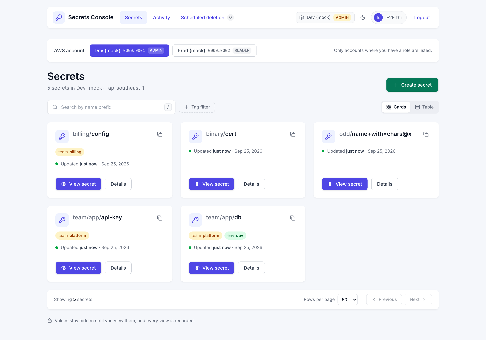

## What it does

|                                                                                      | reader | writer | admin |
| ------------------------------------------------------------------------------------ | ------ | ------ | ----- |
| List, search, view metadata, tags, versions                                          | yes    | yes    | yes   |
| View a value (audited, auto-hides after 30 s or when the tab is hidden)              | yes    | yes    | yes   |
| Create, update value (key-level diff confirmation, conflict-checked), edit tags      | –      | yes    | yes   |
| Delete (30-day recovery window, no force delete), restore, roll back a version       | –      | –      | yes   |
| Activity page: who did what, from CloudTrail, including changes made outside the app | –      | –      | yes   |

A user with no role in an account can't see that the account exists (404). This matrix is
`ACTION_MIN_ROLE` in `src/lib/auth/rbac.ts`. The same table produces the AWS session policy for
each tier, so IAM enforces it as well as the app.

## How it works

```
Browser ──session cookie──▶ Next.js (one container, :3000)
  proxy.ts          per-request CSP nonce; redirects to /login when there's no cookie (not authz)
  pages (RSC)       requireRole → metadata only; values never render on the server
  server actions    withAction: zod → requireRole → AWS → audit (in finally)
  AWS               base identity (IRSA in EKS, profile/env locally)
                      → sts:AssumeRole(account.roleArn, tier session policy, SourceIdentity=UPN)
```

- **Sign-in:** authorization code flow with PKCE (`openid-client`). The session is a sealed
  `iron-session` cookie that holds the resolved roles, never raw group ids, and lasts 1 hour.
- **Audit:** JSON lines on stdout (`"type":"audit"`) covering who, account, tier, action, secret,
  and the outcome (ok, denied or error). Denied and failed attempts are audited too. In AWS,
  CloudTrail records the real person through `SourceIdentity`.

## Run it locally

Prerequisites: Node 24+, pnpm 10, and Docker (colima works) for moto and the image.

```bash
pnpm install
```

| Mode                  | Command                                                                                                                                                    | Needs                                                                                                                                       |
| --------------------- | ---------------------------------------------------------------------------------------------------------------------------------------------------------- | ------------------------------------------------------------------------------------------------------------------------------------------- |
| **No cloud at all**   | `pnpm dev:mock`                                                                                                                                            | Docker. Starts moto (a local AWS fake) on :5055, seeds sample secrets in two mock accounts, and shows a dev-only persona picker on `/login` |
| Real Entra + real AWS | `cp .env.example .env` (fill it in), then `AWS_PROFILE=<profile> pnpm dev`                                                                                 | An Entra app registration (`docs/entra-setup.md`) and a role per account (`docs/iam-setup.md`)                                              |
| Production image      | `scripts/build.sh`, then `docker run --env-file .env -e AWS_PROFILE=<p> -v ~/.aws:/home/nextjs/.aws:ro -p 3000:3000 dinhdobathi/aws-secrets-manager:2.0.0` | As above                                                                                                                                    |
| Compose               | `AWS_PROFILE=<p> docker compose up`                                                                                                                        | As above. On Linux add `APP_UID=$(id -u) APP_GID=$(id -g)`                                                                                  |

On Linux, `~/.aws` files belong to your user, so the container must run as you: add
`--user $(id -u):$(id -g) --tmpfs /app/.next/cache:mode=1777` to `docker run`, or set
`APP_UID`/`APP_GID` for compose.

`.env` rules: **no quotes around values** (`docker run --env-file` keeps them literally), and
**no `$`** (compose expands it). Generate the session secret with `openssl rand -hex 32`.

## Configuration

| Variable                                 | Required | Notes                                                                                                                                      |
| ---------------------------------------- | -------- | ------------------------------------------------------------------------------------------------------------------------------------------ |
| `ACCOUNTS`                               | yes      | JSON array: `id` (lowercase, digits, `-`), `name`, `region`, `roleArn` (required), `groups.{reader,writer,admin}` (Entra group object ids) |
| `APP_URL`                                | yes      | Public base URL. The OIDC redirect is `${APP_URL}/api/auth/callback`. Read at runtime only                                                 |
| `SESSION_SECRET`                         | yes      | At least 32 characters                                                                                                                     |
| `ENTRA_TENANT_ID`                        | yes      | Tenant **GUID** (not `common`)                                                                                                             |
| `ENTRA_CLIENT_ID`, `ENTRA_CLIENT_SECRET` | yes      | App registration                                                                                                                           |
| `APP_NAME`, `APP_LOGO_URL`, `LOG_LEVEL`  | no       | Branding (logo: a same-origin path or an https URL) and pino level                                                                         |
| `AWS_PROFILE` / IRSA                     | –        | The base identity for AssumeRole. The standard AWS SDK chain is used                                                                       |

Bad configuration never crashes silently. `/api/health?ready` returns 503, and the log names the
failing field, e.g. `ACCOUNTS[prod].groups.admin`.

## Scripts

| Command                        | What it does                                                                                              |
| ------------------------------ | --------------------------------------------------------------------------------------------------------- |
| `pnpm lint` / `pnpm typecheck` | ESLint (bans `JSON.parse` and `.json()` on secret data) and `tsc`                                         |
| `pnpm test`                    | Unit tests (vitest). Single test: `pnpm vitest run src/lib/auth/rbac.test.ts -t "admin"`                  |
| `pnpm test:integration`        | Secrets Manager lifecycle against moto (starts and stops it)                                              |
| `pnpm test:e2e`                | Playwright against a production build + moto: every role, conflicts, leak check                           |
| `scripts/image-smoke.sh`       | One image, two `APP_URL`s: a server action works in both, cross-origin is rejected, no values in the logs |
| `scripts/build.sh`             | Builds the image locally. `PUSH=1` builds amd64+arm64 and pushes (explicit, separate decision)            |

Full gate: `pnpm lint && pnpm typecheck && pnpm test && pnpm test:integration && pnpm test:e2e && pnpm audit --prod --audit-level=high && scripts/build.sh && scripts/image-smoke.sh && helm lint helm/aws-secrets-manager`

## Design

Light, card-based UI (Inter, indigo primary, green create/save), with a dark-mode toggle whose
tokens are interim. The UI/UX contract (tokens, screens, role visibility, behaviour rules) is
`docs/design-contract.md`.

Screenshots come from the e2e mock (moto, fake seeded data, admin persona):

|                                                                                                                     |                                                                                                                      |
| ------------------------------------------------------------------------------------------------------------------- | -------------------------------------------------------------------------------------------------------------------- |
| 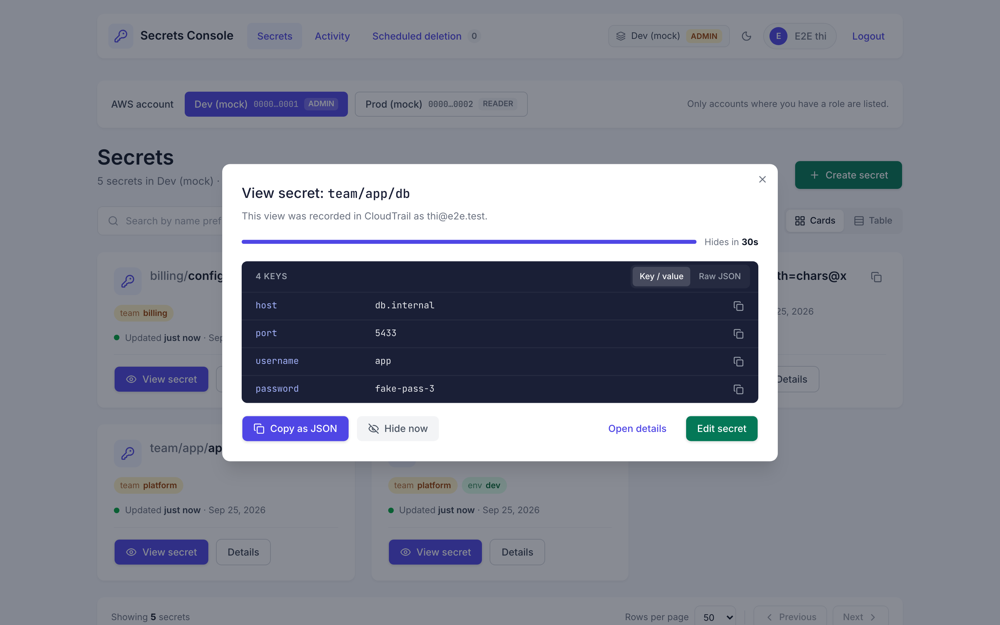 View secret: audited quick view with countdown               | 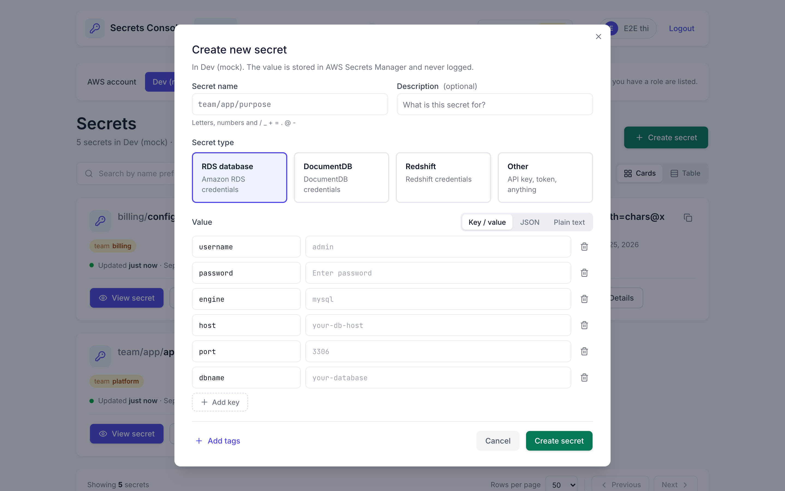 Create: RDS / DocumentDB / Redshift / Other templates (key names only) |
| 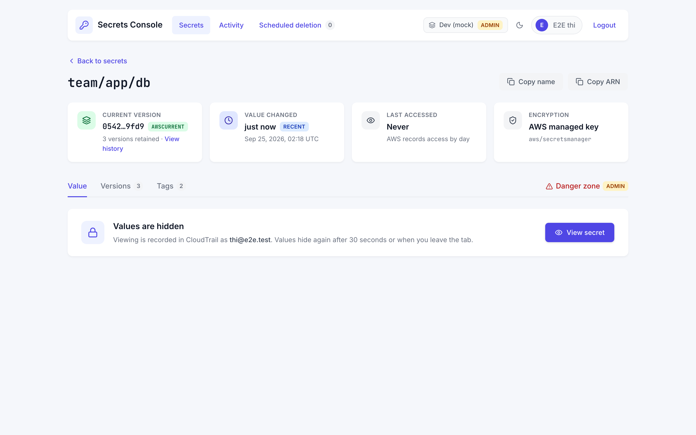 Detail: four tiles, values hidden until View | 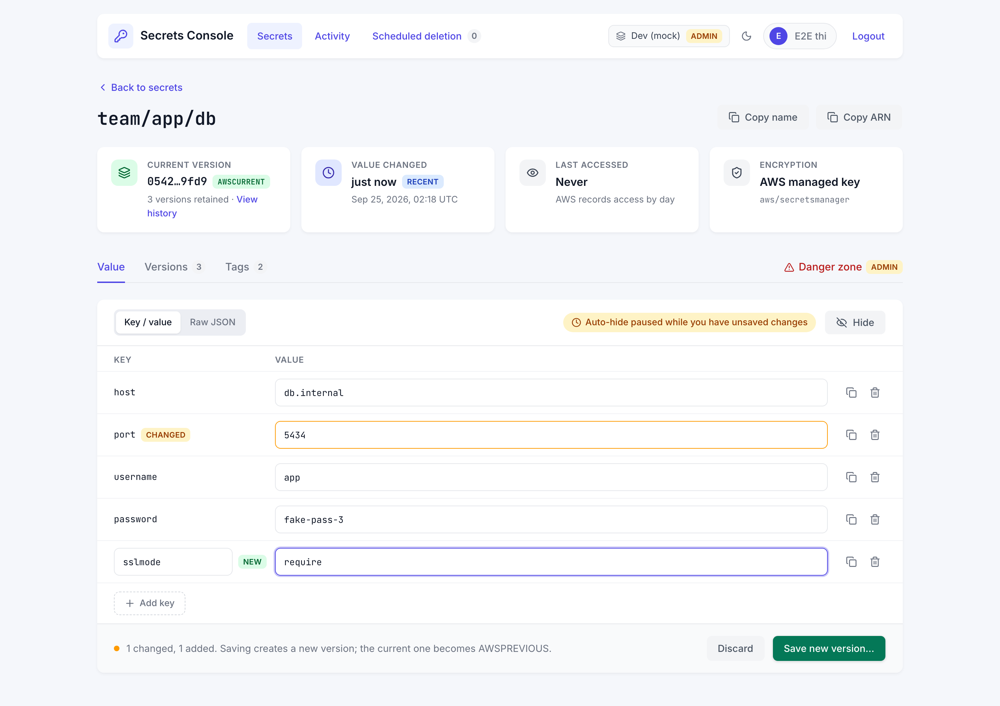 Editing: CHANGED / NEW rows, auto-hide paused      |
| 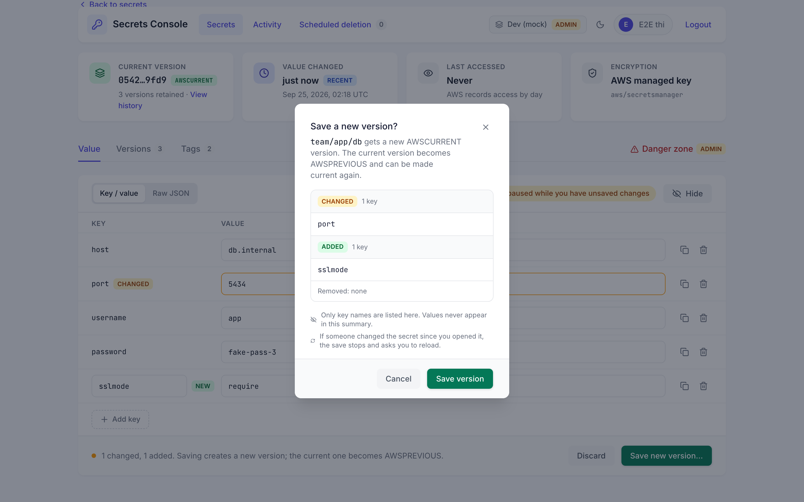 Save: key names only, never values                          | 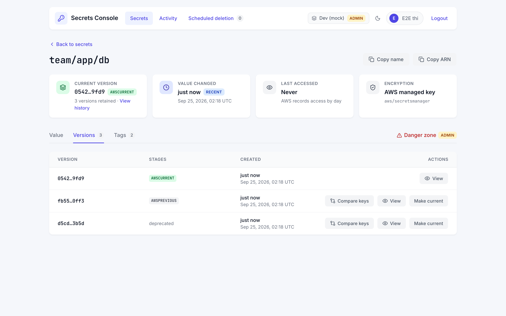 Versions: compare keys, view, make current                                |
| 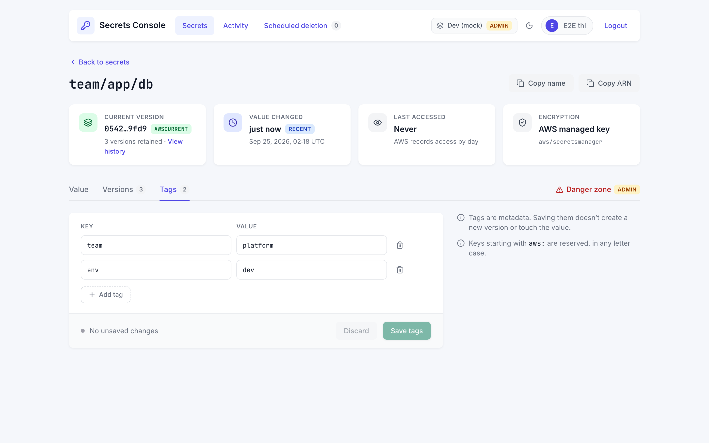 Tags: unsaved-change count                                                       | 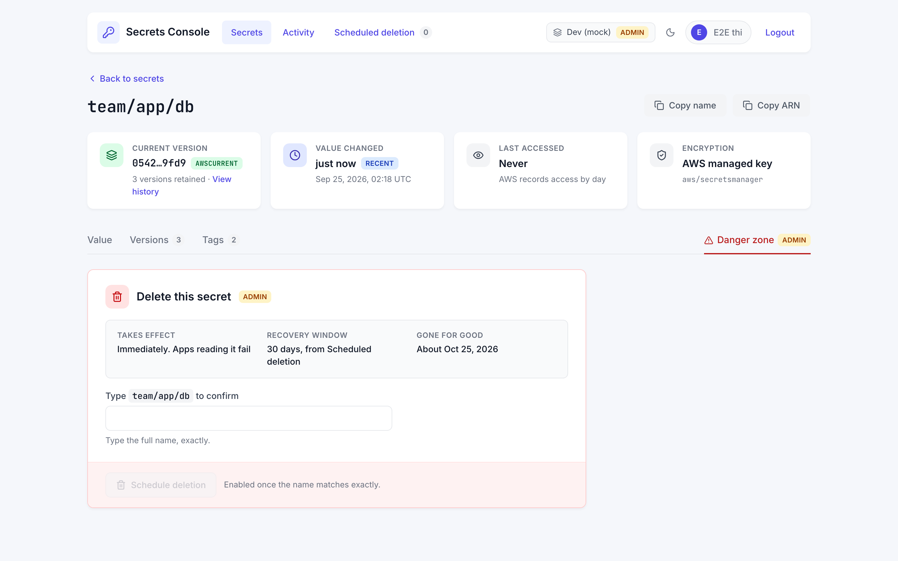 Danger zone (admin): 30-day recovery, typed-name confirm                 |
| 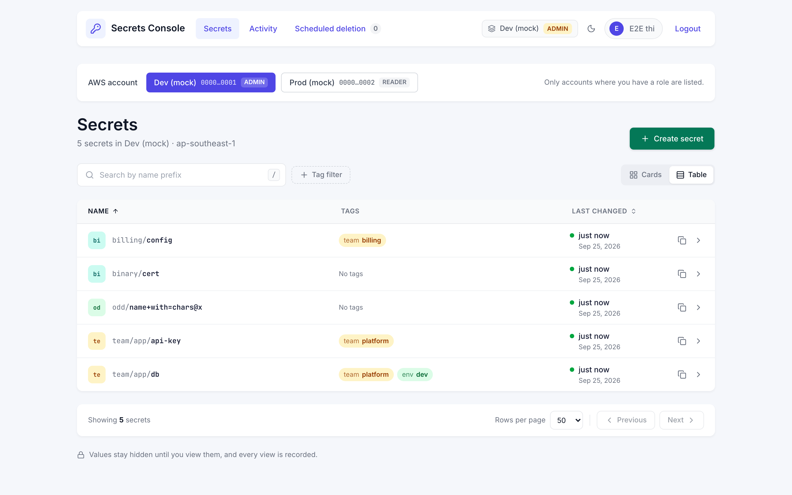 Table layout                                            | 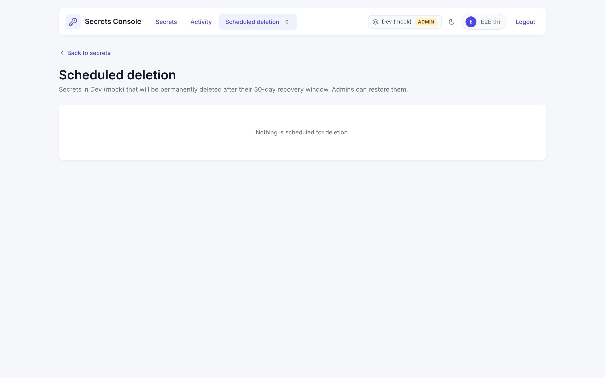 Scheduled deletion                                               |

The Activity page isn't pictured: moto doesn't implement CloudTrail `LookupEvents`, and a real
account's events would show real people and resources.

## Deploy

See `helm/aws-secrets-manager/README.md` (chart 0.2.0, which is a breaking change from 0.1.x),
`docs/iam-setup.md` and `docs/entra-setup.md`.

## Known gaps

- **Tested against moto, not AWS, for:**
  - version staging edge cases, deletion and KMS behaviour;
  - IAM, session policies and account boundaries, which moto doesn't enforce. Mock-level unit
    tests prove the app passes the right `roleArn`, session policy and `SourceIdentity`.
- **moto differs from AWS on `DeletedDate`.** Real AWS returns when deletion was requested
  (checked on a real account on 2026-09-25). moto returns the permanent-deletion date, so
  `dev:mock` shows a later date than real AWS would.
- **moto doesn't implement CloudTrail `LookupEvents`.** The Activity page's data path is covered
  by unit tests and was tested manually against a real account. e2e covers its authorization
  only.
- **Activity page limits:**
  - CloudTrail event history covers 90 days and lags about 15 minutes.
  - Each view loads up to 4 pages (200 events).
  - Attempts the app blocks never reach AWS, so they appear only in the app's audit log.
- **Signing in:**
  - Groups overage (the token carries a group-overage marker instead of a `groups` list) is
    rejected with an explanation; there is no Microsoft Graph fallback.
  - Removing someone from a group takes effect at their next sign-in, within 1 hour.
- **Secrets list:**
  - Sorting and the exact tag-pair filter apply within the current page. AWS paginates by
    creation date.
  - Names containing `.`, `..` or empty path segments work, but use a `~`-encoded URL.
- **Clipboard:** clearing it after 30 seconds is best-effort and depends on browser permission.
